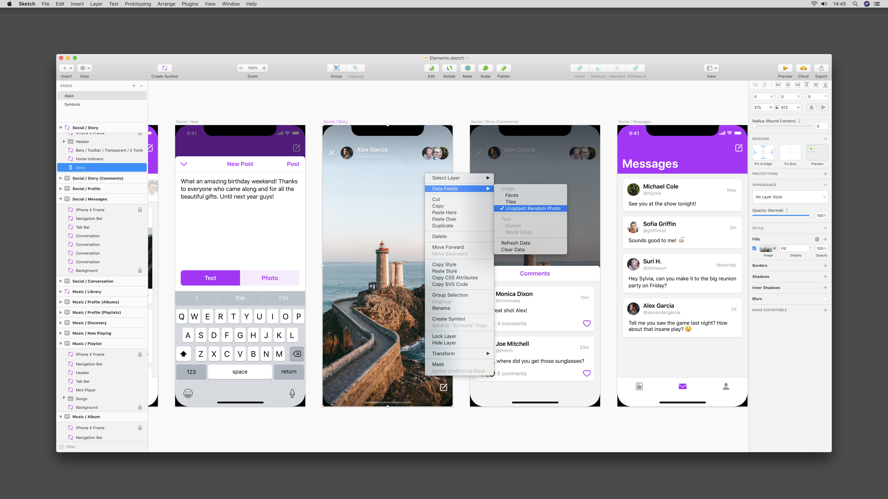
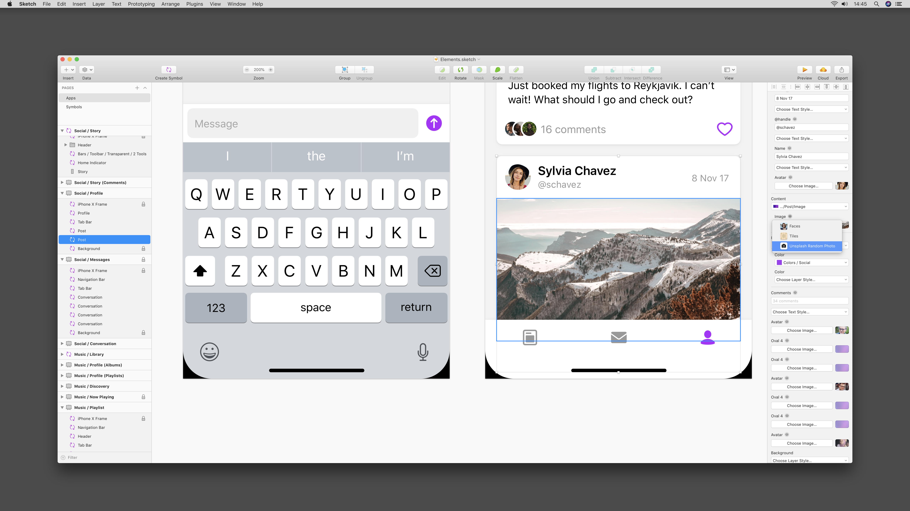

# Unsplash Data Plugin

## Features

Get random image from Unsplash, using Sketch 52’s new Data Supplier feature:

When you’ve set an image fill for a layer, you can later on open the original URL for an image, in case you need to full credits, or download the original file, etc. To do that, click Plugins › Unsplash › View Photo on Unsplash. It does not work for overrides yet, but we’re working on it!
